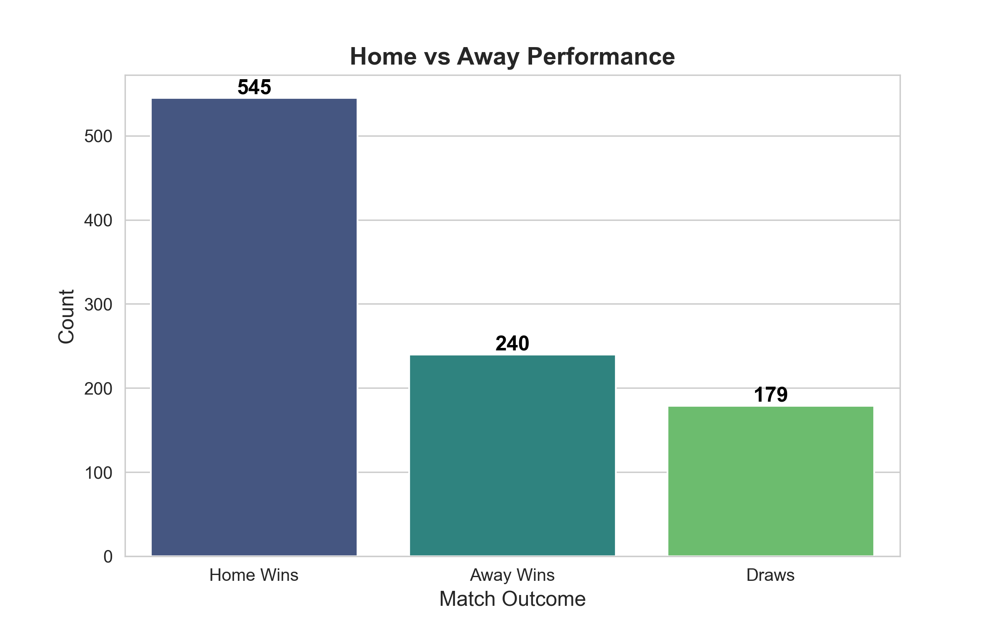
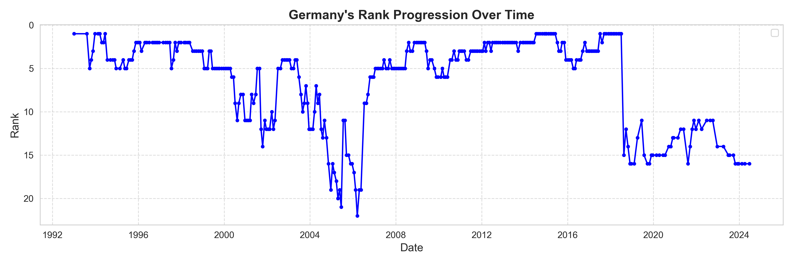
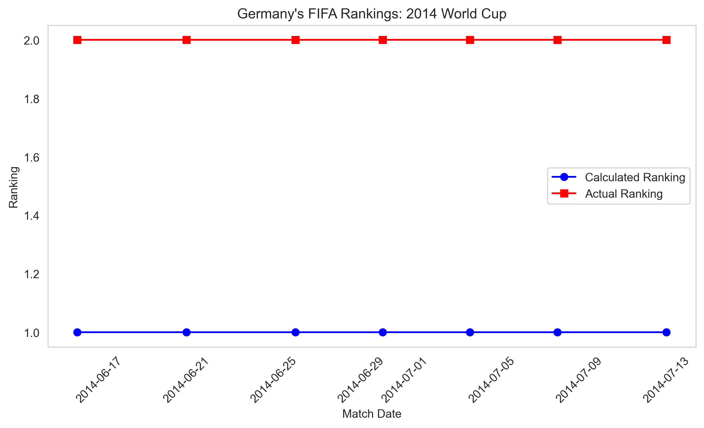

# ⚽ Soccer Match Analysis and Prediction Using a Bivariate Poisson Model

## 📌 Overview

This project analyzes **FIFA World Cup match data** to model team performance and predict outcomes using a **Bivariate Poisson model**. The workflow includes:

- Data preprocessing
- Exploratory Data Analysis (EDA)
- Time-weighted modeling
- Predictive modeling using Maximum Likelihood Estimation (MLE)
- Evaluation using Rank Probability Score (RPS)
- Comparison of Germany’s predicted FIFA ranking vs. actual rankings

---

## 🧾 1. Data Loading and Preprocessing

The script uses the following datasets:
- `matches.csv` – Match results, team performances, outcomes
- `fifa_ranking-2024-06-20.csv` – Historical FIFA team rankings

### Steps:
- Filters only **FIFA Men’s World Cup matches**
- Converts `match_date` to datetime for chronological analysis
- Selects relevant columns and checks for missing values

---

## 📊 2. Exploratory Data Analysis (EDA)

Insights derived from the visualizations:

- **Home vs. Away Performance**  
  

- **Germany's FIFA Ranking Over Time**  
  

---

## 🧠 3. Data Splitting and Time Decay

- Dataset split: **80% training / 20% testing**
- Matches are **chronologically ordered**
- Introduced **time-weighting**:
  - Exponential decay applied to older matches
  - **Half-period**: 390 days
  - Gives more importance to recent performances

---

## 🔬 4. Bivariate Poisson Model for Match Prediction

### 4.1 Model Overview
- Predicts match outcomes by estimating:
  - `λ_home` = Home team's scoring rate  
  - `λ_away` = Away team's scoring rate  
  - `λ_common` = Shared influence on both teams’ scores

### 4.2 Parameter Estimation
- Used **Maximum Likelihood Estimation (MLE)** with **L-BFGS-B** optimization
- Parameters bounded to ensure positivity
- Model learns scoring tendencies of each team

### 4.3 Outcome Prediction
- Goal probability matrix generated per match
- Most probable scoreline selected
- Predictions saved and analyzed

---

## 🧪 5. Model Evaluation: Rank Probability Score (RPS)

- **RPS** evaluates prediction quality by comparing predicted vs. actual outcomes
- Lower scores = better accuracy

---

## 🇩🇪 6. Germany’s FIFA Ranking vs. Predictions

- Used **FIFA 2006–2018 ranking formula**:
  - Match importance
  - Opponent strength
  - Confederation weighting
- Predicted vs. Actual rankings visualized:
  - 

---

## 📁 Outputs

| Visualization | Description |
|---------------|-------------|
| `home_away_performance_annotated.png` | Home vs. Away win distribution |
| `Distribution_of_Total_Goals_per_Match.png` | Total goal distribution |
| `Average_Goals_per_Match_Over_Years.png` | Trend of average goals per match |
| `germany_rank_progression.png` | Germany's FIFA ranking trend |
| `germany_ranking_2014.png` | Germany’s predicted vs. actual ranking (2014) |

---

## 📎 Notes

- The Bivariate Poisson model is particularly effective for **goal-based sports predictions**
- Time-weighted models improve performance by focusing on **more recent matches**
- The ranking comparison provides a unique side-analysis for **national team performance tracking**

---

